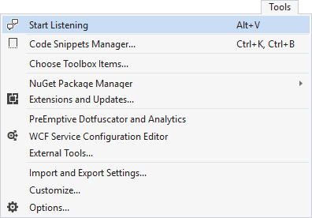

# Voice Commands for Visual Studio

Download the extension at the
[VS Gallery](https://visualstudiogallery.msdn.microsoft.com/ce35c120-405a-435b-af2a-52ff24eb2c30)
or get the
[nightly build](http://vsixgallery.com/extension/b4558cd7-da41-47e7-8969-46c357a1b8b3/)

----------------------

Voice Command let's you control Visual Studio using your own
voice and high accuracy.

**Demo video**

[Play video](https://www.youtube.com/watch?v=Zo7o9tDigC4) _(3:19)_

Here's how to use it:

1. Hit `Alt+V` (or go to Tools -> Start Listening)
2. Say the name of a command. Examples:
 - Build
 - Format Document
 - Solution Explorer
 - New Project
 - Options
 - See  full list of [available voice commands](https://github.com/ligershark/VoiceExtension/blob/master/src/Resources/commands.txt)
 - See the list by saying What can I say?

That's it. It's that simple.

## How it works

Under the hood, Voice Commands uses Windows Speech API to
handle the voice recognition. The Windows Speech API is part
of Windows and can be accessed by adding a reference to
`System.Speech`.

### Calibrate the speech recognition
Since this extension uses the Windows speech APIs,
you can train Windows to better understand your particular
speech patterns.

See the videos and tutorial on
[how to use Speech Recognition](http://windows.microsoft.com/en-US/windows-8/using-speech-recognition/).